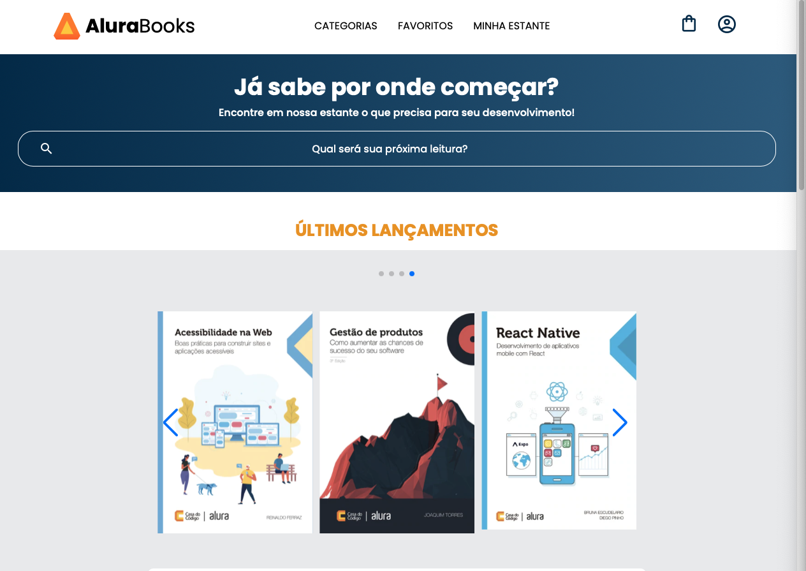

<h1 align="center">Alura Books</h1>

Projeto desenvolvido na formação **A partir do zero: HTML e CSS para projetos web** da _Alura_. O foco principal foi praticar a construção de _layouts_ utilizando a metodologia **Mobile First**, que consiste em iniciar a construção para telas menores primeiro e ir incrementando alterações para telas maiores posteriormente, com o auxílio de _medias queries_.

## ✨ Sobre o Projeto ##

 

O projeto é uma página de internet, criada com o objetivo de reforçar conhecimentos em estruturação HTML e estilização com CSS moderno. 
O layout foi inspirado no modelo do Figma que pode ser visualizado através do link:
🔗 [Figma do Alura Books](https://www.figma.com/community/file/1410386210865694868)

## 🛠️ Tecnologias Utilizadas ##

* HTML5
* CSS3: Flexbox
* JavaScript (através da API Swiper, responsável por construir o efeito de carrossel dos livros)

## 🖥️ Como visualizar ##

Você pode clonar este repositório e abrir o arquivo ``index.html`` em qualquer navegador. Também pode usar uma extensão como **Live Server** no _VS Code_ para uma visualização dinâmica. Ou ainda, acessar o projeto _online_ clicando no link da _Vercel_: 🔗[Acesse o Projeto Online](https://atura-books.vercel.app)

## 💡 Aprendizados ##

Durante esse projeto, consegui aprofundar os seguintes conceitos:
* Estrutura básica de um documento HTML;
* Organização de _layout_ com CSS Flexbox;
* Construção de layouts responsivos com o uso de _media queries_;
* Boas práticas de estilização com CSS.

## 📚 Créditos ##

Este projeto foi desenvolvido durante o curso da **Alura** e esse Readme foi estruturado com a a ajuda do **ChatGPT**. O efeito de carrossel, com as imagens dos livros, foi obtido com o auxílio da API Swiper (maiores informações no 🔗[site](https://swiperjs.com/).
)

